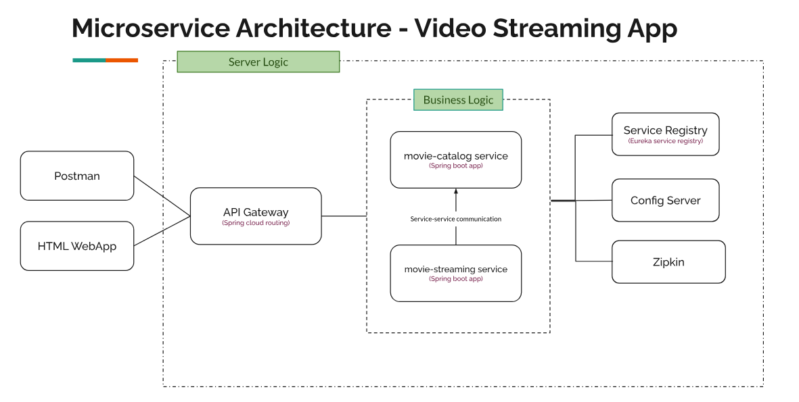
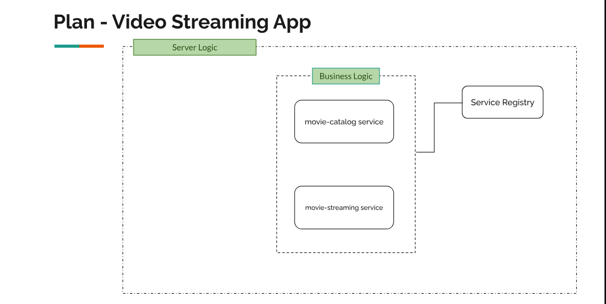
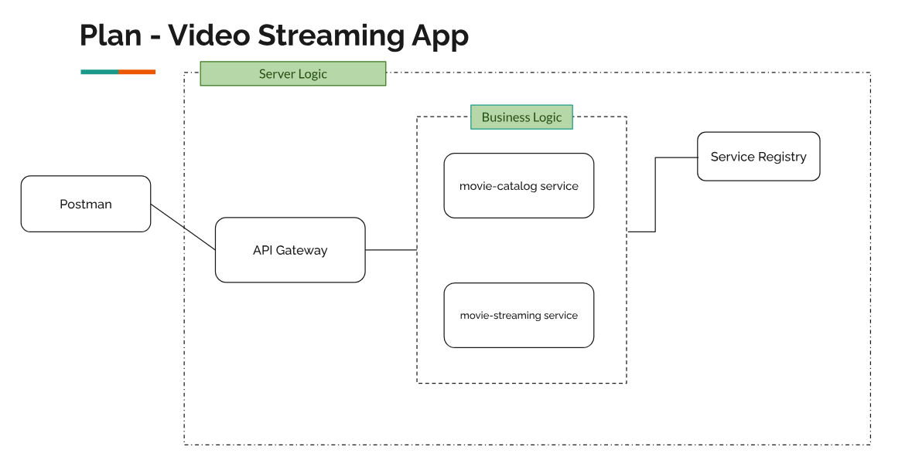
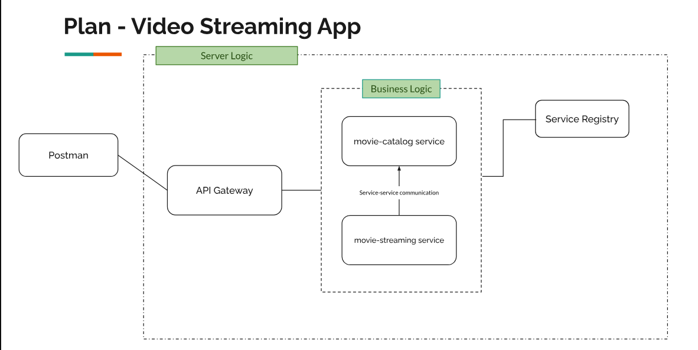
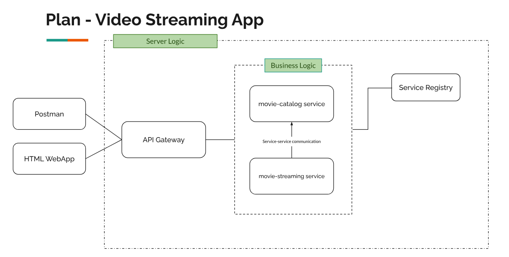
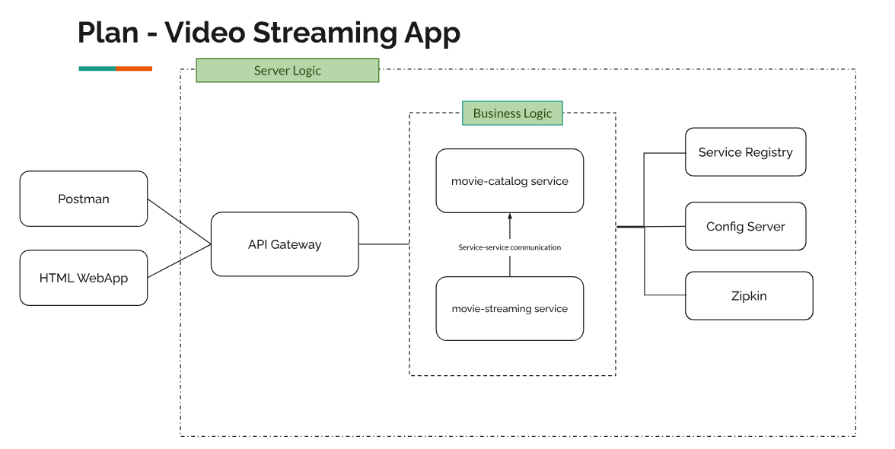

### Application Design


<br>
<br>

### Creating micro-services and testing with individual ports 


<br>
<br>


### Using API Gateway 


<br>
<br>

### Service to Service Communication


<br>
<br>


### HTML Web App




<br>
<br>


### Final Microservice


***

``` bash
    https://genuinecoder.com/microservices-using-spring-boot-tutorial/
```